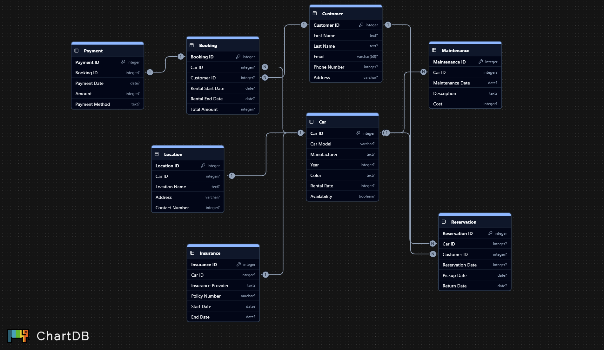

# Car Rental ERD

## Description
This is an Entity-Relationship Diagram (ERD) for a simple Car Rental database. The diagram illustrates the relationships between the relevant entities

### Entities
- Car
- Customer
- Booking
- Payment
- Maintenance
- Location
- Insurance
- Reservation